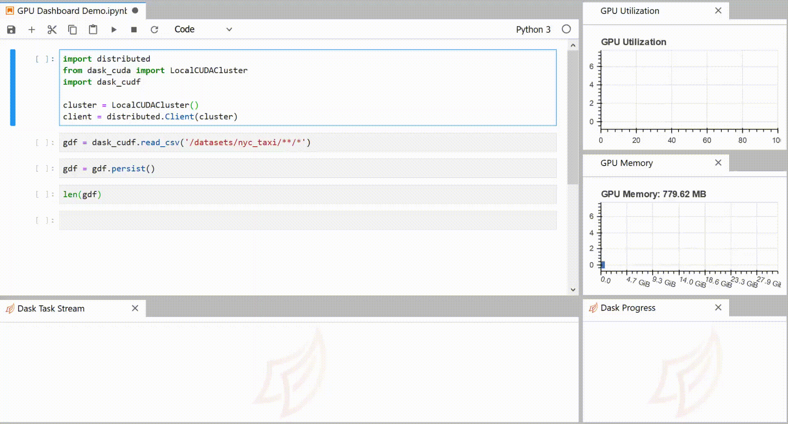

# JupyterLab NVDashboard




NVDashboard is a JupyterLab extension for displaying GPU usage dashboards. It enables JupyterLab users to visualize system hardware metrics within the same interactive environment they use for development. Supported metrics include:

- GPU-compute utilization
- GPU-memory consumption
- PCIe throughput
- NVLink throughput


This extension is composed of a Python package named `jupyterlab_nvdashboard`
for the server extension and a NPM package named `jupyterlab-nvdashboard`
for the frontend extension.


## Requirements

* JupyterLab >= 3.0

## Install

```bash
pip install jupyterlab_nvdashboard
```


## Troubleshoot

If you are seeing the frontend extension, but it is not working, check
that the server extension is enabled:

```bash
jupyter server extension list
```

If the server extension is installed and enabled, but you are not seeing
the frontend extension, check the frontend extension is installed:

```bash
jupyter labextension list
```


## Contributing

### Development install

Note: You will need NodeJS to build the extension package.

The `jlpm` command is JupyterLab's pinned version of
[yarn](https://yarnpkg.com/) that is installed with JupyterLab. You may use
`yarn` or `npm` in lieu of `jlpm` below.

```bash
# Clone the repo to your local environment
# Change directory to the jupyterlab_nvdashboard directory
# Install package in development mode
pip install -e .
# Link your development version of the extension with JupyterLab
jupyter labextension develop . --overwrite
# Rebuild extension Typescript source after making changes
jlpm run build
```

You can watch the source directory and run JupyterLab at the same time in different terminals to watch for changes in the extension's source and automatically rebuild the extension.

```bash
# Watch the source directory in one terminal, automatically rebuilding when needed
jlpm run watch
# Run JupyterLab in another terminal
jupyter lab
```

With the watch command running, every saved change will immediately be built locally and available in your running JupyterLab. Refresh JupyterLab to load the change in your browser (you may need to wait several seconds for the extension to be rebuilt).

By default, the `jlpm run build` command generates the source maps for this extension to make it easier to debug using the browser dev tools. To also generate source maps for the JupyterLab core extensions, you can run the following command:

```bash
jupyter lab build --minimize=False
```

### Uninstall

```bash
pip uninstall jupyterlab_nvdashboard
```

Releases for both packages are handled by [gpuCI](https://gpuci.gpuopenanalytics.com/job/rapidsai/job/gpuci/job/jupyterlab-nvdashboard/). Nightly builds are triggered when a push to a versioned branch occurs (i.e. `branch-0.5`). Stable builds are triggered when a push to the `main` branch occurs.
