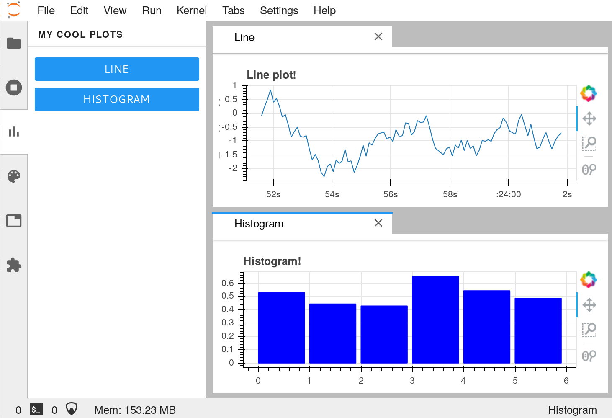
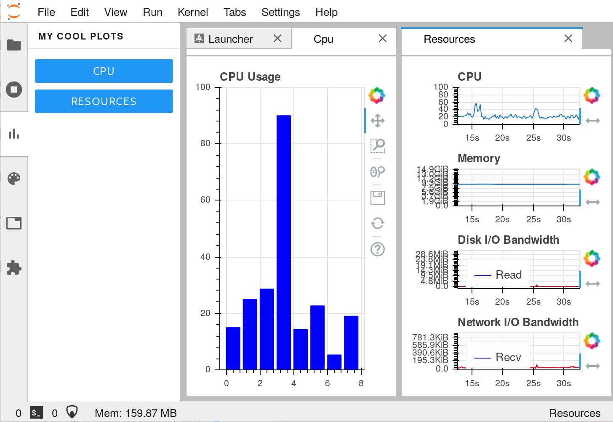

JupyterLab and Bokeh Server
===========================

A JupyterLab extension for displaying the contents of a Bokeh server.

This project serves as an example for how to integrate a Bokeh server
application into JupyterLab.  This makes it easy for Python developers to
develop rich dashboards and integrate them directly into Jupyter environments.

Motivation
----------

We want to give Jupyter users rich and real-time dashboards while they work.
This can be useful for tracking quantities like the following:

-  Computational resources like CPU, Memory, and Network
-  External instruments or detectors
-  Other resources like GPU accelerators
-  Web APIs
-  ...

[JupyterLab](https://jupyterlab.readthedocs.io/en/stable/) extensions provide
a platform for these dashboards, but require some JavaScript expertise.  For
Python-only developers, this requirement may prove to be a bottleneck.
Fortunately the [Bokeh](https://bokeh.pydata.org) plotting library makes it
easy to produce rich and interactive browser-based visuals from Python,
effectively crossing this boundary.

This repository serves as an example on how to create rich dashboards in Python
with Bokeh and then smoothly integrate those dashboards into JupyterLab for a
first-class dashboarding experience that is accessible to Python-only
developers.


What's here
-----------

This repository contains two sets of code:

-   Python code defining a Bokeh Server application that generates a couple of
    live plots in the `jupyterlab_nvdashboard/` directory
-   TypeScript code integrating these plots into JupyterLab in the `src/`
    directory

You should be able to modify only the Python code to produce a dashboard system
that works well for you without modifying the TypeScript code.

There are also two branches in this repository:

1.  **master** contains a basic dashboard with two plots, a line plot and
   a histogram, that display randomly varying data:

   And is available in a live notebook here: `TODO binder link`

-  **system-resouces** expands on the toy system above to create a real-world example
   that uses the `psutil` module to show CPU, memory, network, and storage
   activity:

   And is available in a live notebook here: `TODO binder link`

You can view the [difference between these two branches](https://github.com/ian-r-rose/jupyterlab-bokeh-server/compare/system-resources).
This should give a sense for what you need to do to construct your own
JupyterLab enabled dashboard.


History
-------

This project is a generalization of the approach taken by the
[Dask JupyterLab Extension](https://github.com/dask/dask-labextension) which
integrates a rich dashboard for distributed computing into JupyterLab, which
has demonstrated value for many Dask and Jupyter users in the past.


## Prerequisites

* JupyterLab 1.0.0a3
* bokeh

## Installation

This extension has a server-side (Python) and a client-side (Typescript) component,
and we must install both in order for it to work.

To install the server-side component, run the following in your terminal

```bash
pip install jupyterlab-nvdashboard
```

To install the client-side component, run

```bash
jupyter labextension install jupyterlab-nvdashboard
```

## Development

To install the server-side part, run the following in your terminal from the repository directory:

```bash
pip install -e .
```

In order to install the client-side component (requires node version 8 or later), run the following in the repository directory:

```bash
jlpm install
jlpm run build
jupyter labextension install .
```

To rebuild the package and the JupyterLab app:

```bash
jlpm run build
jupyter lab build
```

## Publishing

In order to distribute your bokeh dashboard application,
you must publish the two subpackages.
The JupyterLab frontend part should be published to [npm](https://npmjs.org),
and the server-side part to [PyPI](https://pypi.org)
or [conda-forge](https://conda-forge.org) (or both).

Instructions for publishing the JupyterLab extension can be found
[here](https://jupyterlab.readthedocs.io/en/stable/developer/xkcd_extension_tutorial.html#publish-your-extension-to-npmjs-org).
A nice write-up for how to publish a package to PyPI can be found in the
[nbconvert documentation](https://nbconvert.readthedocs.io/en/latest/development_release.html).
