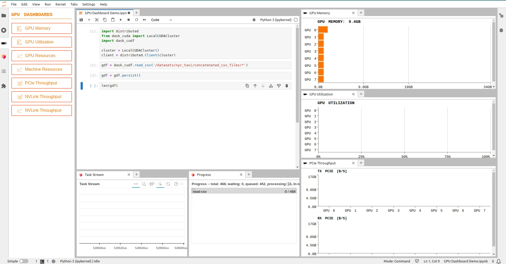
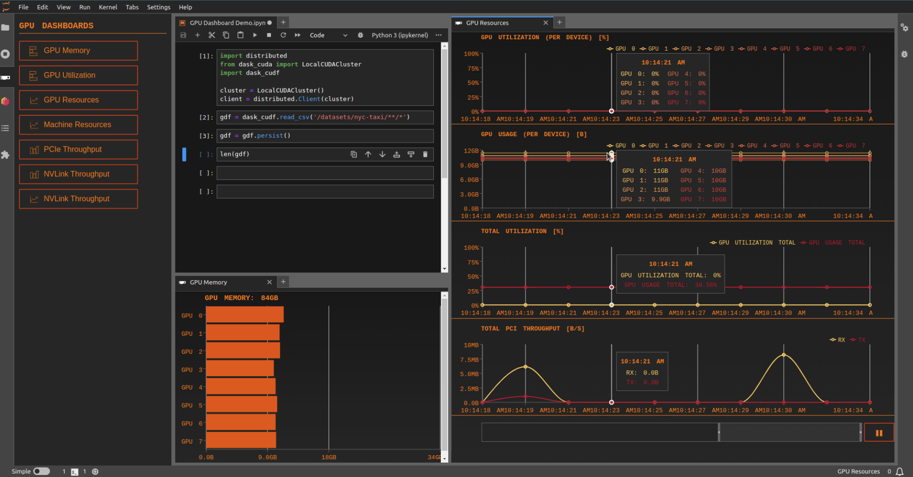
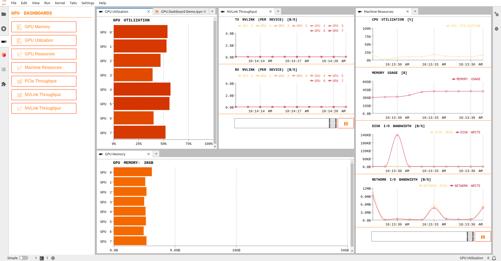
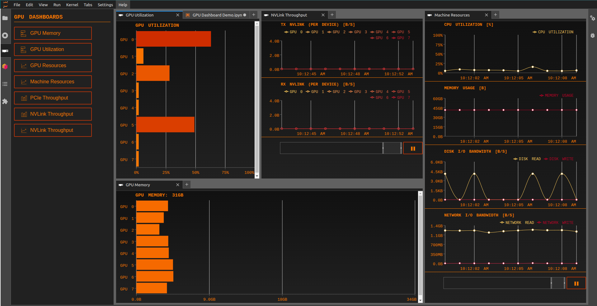

# JupyterLab NVdashboard

NVDashboard is a JupyterLab extension for displaying GPU usage dashboards. It enables JupyterLab users to visualize system hardware metrics within the same interactive environment they use for development. Supported metrics include:

- GPU-compute utilization
- GPU-memory consumption
- PCIe throughput
- NVLink throughput

## Demo



## Table of Contents

- [New Features](#new-features)
  - [Brush for Time Series Charts](#brush-for-time-series-charts)
  - [Synced Tooltips](#synced-tooltips)
  - [Theme Compatibility](#theme-compatibility)
- [Version Compatibility](#version-compatibility)
- [Requirements](#requirements)
- [Installation](#installation)
- [Troubleshoot](#troubleshoot)
- [Contributing](#contributing-developers-guide)
- [Future Improvements](#future-improvements)

## New Features

JupyterLab-nvdashboard v4 brings a host of new features, improved backend architecture, and enhanced frontend components for an even better user experience.
Explore the exciting updates below.

### Brush for Time Series Charts

Introducing a powerful brushing feature for time series charts. Users can easily inspect past events by selecting a specific time range, providing more granular control over data exploration.


### Synced Tooltips

For pages with multiple charts, JupyterLab-nvdashboard now offers synchronized tooltips for timestamps across all charts. This feature enhances the user's ability to analyze data cohesively and understand relationships between different data points.



### Theme Compatibility

Seamless integration with JupyterLab themes is now a reality. The extension adapts its colors and aesthetics based on whether the user is in a light or dark theme, ensuring a consistent and visually appealing experience.

#### Light Theme



#### Dark Theme



## Version Compatibility

JupyterLab-nvdashboard v4 is designed exclusively for JupyterLab v4 and later versions. To ensure continued support for JupyterLab v3 users, we will maintain the previous version separately (branch-0.9).

## Requirements

- JupyterLab >=4
- pynvml
- psutil

## Installation

### Conda

```bash
conda install -c rapidsai jupyterlab-nvdashboard
```

### PyPI

```bash
pip install jupyterlab-nvdashboard
```

## Troubleshoot

If you are seeing the frontend extension, but it is not working, check
that the server extension is enabled:

```bash
jupyter server extension list
```

If the server extension is installed and enabled, but you are not seeing
the frontend extension, check the frontend extension is installed:

```bash
jupyter labextension list
```

## Contributing Developers Guide

For more details, check out the [contributing guide](./CONTRIBUTING.md).

## Future Improvements

While we've introduced a range of exciting features in this release, we understand that there are always opportunities for improvement. We have noted a request to add cell execution markers to the charts. Due to the complexities associated with asynchronous cells, we have decided to defer this feature to a future update. Rest assured, we will explore this enhancement in subsequent releases.
